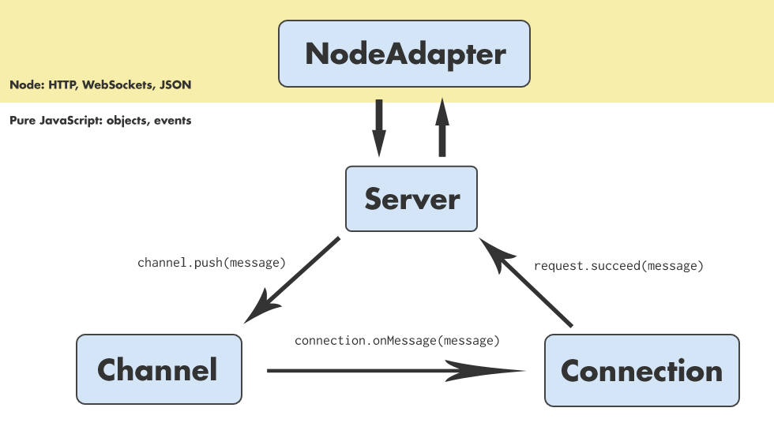

!SLIDE callout
# Great!
## But how does it work?

!SLIDE bullets
# Principles

* Keep it portable
* Never block
* Use events

!SLIDE bullets
# Portability
* Write core logic in "generic" JavaScript
* Provide thin bindings to Node HTTP libs

!SLIDE callout
# Never block
## What if there were no `return`?

!SLIDE center
# Architecture

!SLIDE
# NodeAdapter

    @@@ javascript
    Faye.NodeAdapter = function(options) {
      this._options = {};
      this._server  = new Faye.Server();
    };
    
    Faye.NodeAdapter.prototype.
        listen = function(port) {
          var self = this;
          
          var handle = function(req, res) {
            self.handle(req, res);
          };
          
          var httpServer = http.createServer(handle);
          httpServer.listen(port);
        };

!SLIDE
# NodeAdapter

    @@@ javascript
    // Incoming request:
    // GET /?message={...}&jsonp=blah
    
    Faye.NodeAdapter.prototype.
        handle = function(request, response) {
          var params  = url.parse(request.url, true).query,
              message = JSON.parse(params.message);
          
          this._server.process(message, function(reply) {
            var json   = JSON.stringify(reply),
                script = params.jsonp + '(' + json + ');';
            
            response.writeHead(200, { /* ... */ });
            response.write(script);
            response.end();
          });
        };

!SLIDE
# Server

    @@@ javascript
    Faye.Server = function() {
      this._channels    = new Faye.Channel.Tree();
      this._connections = {};
    };

!SLIDE
# Server
    
    @@@ javascript
    // message = { "channel":  "/some/channel",
    //             "clientId": "p780cnvop2",
    //             "data":     {"hello": "world"}
    //           }
                  
    Faye.Server.prototype.
        process = function(message, callback, scope) {
          var channel = message.channel;
          if (channel === '/meta/connect') {
            this.acceptConnection(message, callback, scope);
          } else {
            this.distributeMessage(message);
            var reply = this.replyFor(message);
            callback.call(scope, reply);
          }
        };

!SLIDE
# Server

    @@@ javascript
    Faye.Server.prototype.
        acceptConnection = function(message, callback, scope) {
          var clientId   = message.clientId,
              connection = this.getConnection(clientId);
          
          connection.addCallback(callback, scope);
        };
    
    Faye.Server.prototype.
        getConnection: function(clientId) {
          var conns = this._connections;
          
          if (!conns.hasOwnProperty(clientId))
            conns[clientId] = new Faye.Connection(clientId);
          
          return conns[clientId];
        };

!SLIDE
# Server

    @@@ javascript
    Faye.Server.prototype.
        distributeMessage = function(message) {
          var channelName = message.channel,
              channels = this._channels.glob(channelName);
          
          for (var i = 0, n = channels.length; i < n; i++) {
            channels[i].push(message);
          }
        };

!SLIDE
# Channel

    @@@ javascript
    Faye.Channel = function(name) {
      this._name = name;
    };
    
    Faye.Channel.prototype.
        push = function(message) {
          this.publishEvent('receive', message);
        };
    
    Faye.extend(Faye.Channel.prototype,
                Faye.Observable);

!SLIDE
# Connection

    @@@ javascript
    Faye.Connection = function(clientId) {
      this._clientId = clientId;
      this._channels = new Faye.Set();
    };
    
    Faye.Connection.prototype.
        subscribe = function(channel) {
          if (this._channels.includes(channel)) return;
          channel.addSubscriber('receive', function(message) {
            this.setDeferredStatus('success', message);
          }, this);
          this._channels.add(channel);
        };
    
    Faye.extend(Faye.Connection.prototype,
                Faye.Deferrable);
