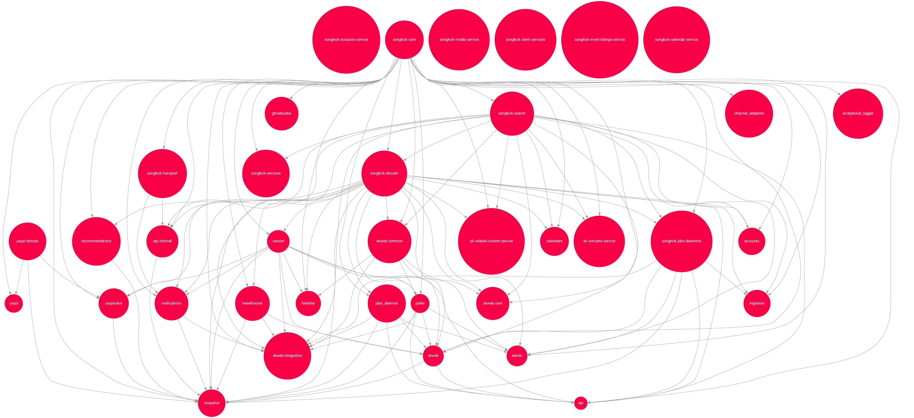

!SLIDE title
# Dependency hell
## And how we got out of it

!SLIDE listing
# The big ball of mud

    app/
        controllers/
        models/
        views/
    features/
    lib/
    vendor/
        api/
        batch_processing/
        daemons/
        file_store/
        notifications/
        web_scrapers/

!SLIDE bullets
# Problems
* *Superficially* modular
* Hidden circular dependencies
* Poor test organisation
* Monolithic deployment
* Change a submodule -> rebuild the **entire** thing

!SLIDE bullets
# Productivity cliff
* Distributed build took > 2 hours
* Shipping anything took days
* Our jobs **sucked**

!SLIDE bullets
# Why did this happen?
* Focus on new features
* Ignorance of tech debt
* Small team can cope with complexity

!SLIDE image center

http://www.flickr.com/photos/freshwater2006/693945631/

!SLIDE bullets
# What did we do about it?
* Extract
* Refactor
* Abstract

!SLIDE title
## Step 1:
# Extract shared code

!SLIDE listing

    app/
        controllers/
        models/           <----- business logic
        views/
    features/             --+
    lib/                    |--- support code
    spec/                 --+

!SLIDE bullets
# We extracted infrastructure and business logic
* songkick-core
* songkick-domain

!SLIDE bullets
# Result:
* We could extract things from the Rails app
* Components could be deployed separately

!SLIDE title
## Step 2:
# Encourage small libraries

!SLIDE bullets
# Should be *easy* to write small modules
* Easy to develop
* Easy to test
* Easy to glue together
* Easy to deploy

!SLIDE bullets
# We made a dependency manager
* Modules must declare their dependencies
* No circular dependencies
* Cannot load code you do not depend on
* Versioning done with git
* Track which commits have been tested together
* Deploy mutually compatible commits

!SLIDE bullets
# Result:
* We were forced to remove circular deps
* We extracted more shared modules
* We only re-tested what was necessary
* We could deploy things separately with confidence

!SLIDE title
# Bonus benefit
## We could **see** the dependency tree

!SLIDE image center dependencies

!SLIDE title
# We still have a problem
## Gems: the cause of, and solution to, all life’s problems

!SLIDE
    @@@ruby
    module Sinatra              # Sinatra
      module Helpers            # Sinatra::Helpers
      end
      
      class Base                # Sinatra::Base
        include Helpers
      end
      
      class Application         # Sinatra::Application
      end
    end

!SLIDE gems
<ul>
  <li>80legs</li>
  <li>aasm</li>
  <li>abstract</li>
  <li>actionmailer</li>
  <li>actionpack</li>
  <li>activerecord</li>
  <li>activerecord-nulldb-adapter</li>
  <li>activeresource</li>
  <li>activesupport</li>
  <li>amazon-ec2</li>
  <li>andand</li>
  <li>apns</li>
  <li>archive-tar-minitar</li>
  <li>ar-extensions</li>
  <li>arrayfields</li>
  <li>asset_hat</li>
  <li>bcrypt-ruby</li>
  <li>bj</li>
  <li>bson</li>
  <li>bson_ext</li>
  <li>builder</li>
  <li>bundler</li>
  <li>bunny</li>
  <li>capistrano</li>
  <li>capistrano-ec2group</li>
  <li>capistrano-ext</li>
  <li>capistrano_rsync_with_remote</li>
  <li>capybara</li>
  <li>celerity</li>
  <li>cgi_multipart_eof_fix</li>
  <li>childprocess</li>
  <li>clickatell</li>
  <li>columnize</li>
  <li>commonwatir</li>
  <li>crack</li>
  <li>cssmin</li>
  <li>cucumber</li>
  <li>cucumber-rails</li>
  <li>curb</li>
  <li>daemons</li>
  <li>database_cleaner</li>
  <li>debulator</li>
  <li>diff-lcs</li>
</ul>
<ul>
  <li>dispatcher</li>
  <li>dolphin</li>
  <li>dolphin-redis</li>
  <li>envjs</li>
  <li>erubis</li>
  <li>etc</li>
  <li>eventful</li>
  <li>eventmachine</li>
  <li>extlib</li>
  <li>ezcrypto</li>
  <li>factory_girl</li>
  <li>fakefs</li>
  <li>fakeweb</li>
  <li>faraday</li>
  <li>fastercsv</li>
  <li>fastthread</li>
  <li>fast_trie</li>
  <li>fattr</li>
  <li>fcgi</li>
  <li>feed-normalizer</li>
  <li>ffi</li>
  <li>firewatir</li>
  <li>flexmock</li>
  <li>forgery</li>
  <li>garb</li>
  <li>gem_plugin</li>
  <li>geoip</li>
  <li>gherkin</li>
  <li>git_remote_branch</li>
  <li>grit</li>
  <li>guid</li>
  <li>happymapper</li>
  <li>harmony</li>
  <li>highline</li>
  <li>hoe</li>
  <li>hpricot</li>
  <li>htmlentities</li>
  <li>httparty</li>
  <li>httpclient</li>
  <li>i18n</li>
  <li>icalendar</li>
  <li>imagesize</li>
  <li>jake</li>
</ul>
<ul>
  <li>janda</li>
  <li>jazz_money</li>
  <li>jeweler</li>
  <li>johnson</li>
  <li>jsmin</li>
  <li>json</li>
  <li>json_pure</li>
  <li>kablame</li>
  <li>kgio</li>
  <li>km</li>
  <li>libxml-ruby</li>
  <li>lockfile</li>
  <li>logging</li>
  <li>lsof</li>
  <li>main</li>
  <li>mash</li>
  <li>mechanize</li>
  <li>mega_mutex</li>
  <li>memcache-client</li>
  <li>methodphitamine</li>
  <li>mime-types</li>
  <li>mislav-will_paginate</li>
  <li>mms2r</li>
  <li>mogilefs-client</li>
  <li>mojombo-grit</li>
  <li>mongo</li>
  <li>mongo_ext</li>
  <li>mongrel</li>
  <li>msgpack</li>
  <li>multi_json</li>
  <li>multipart-post</li>
  <li>multipass</li>
  <li>mysql</li>
  <li>netaddr</li>
  <li>net-scp</li>
  <li>net-sftp</li>
  <li>net-ssh</li>
  <li>net-ssh-gateway</li>
  <li>nokogiri</li>
  <li>oauth</li>
  <li>open4</li>
  <li>orderedhash</li>
</ul>
<ul>
  <li>oyster</li>
  <li>packr</li>
  <li>parallel</li>
  <li>parallel_tests</li>
  <li>pbkdf2</li>
  <li>polyglot</li>
  <li>query_reviewer</li>
  <li>rack</li>
  <li>rack-bug</li>
  <li>rack-protection</li>
  <li>rack-proxy</li>
  <li>rack-test</li>
  <li>rails</li>
  <li>raindrops</li>
  <li>rake</li>
  <li>rbtrace</li>
  <li>rcov</li>
  <li>RedCloth</li>
  <li>redis</li>
  <li>request-log-analyzer</li>
  <li>retryable</li>
  <li>right_aws</li>
  <li>right_http_connection</li>
  <li>rmagick</li>
  <li>rr</li>
  <li>rsolr</li>
  <li>rspec</li>
  <li>rspec-core</li>
  <li>rspec-expectations</li>
  <li>rspec-extra-formatters</li>
  <li>rspec-mocks</li>
  <li>rspec-rails</li>
  <li>rubigen</li>
  <li>rubyforge</li>
  <li>ruby-hmac</li>
  <li>ruby-openid</li>
  <li>ruby-prof</li>
  <li>rubyzip</li>
  <li>s4t-utils</li>
  <li>selenium-webdriver</li>
  <li>sequel</li>
  <li>service-stats</li>
</ul>
<ul>
  <li>shared-mime-info</li>
  <li>simple_oauth</li>
  <li>simple-rss</li>
  <li><em>sinatra</em></li>
  <li>sk-process-management</li>
  <li>smusher</li>
  <li>solr-ruby</li>
  <li>songkick-base-service</li>
  <li>songkick-hammer</li>
  <li>songkick-oauth2-provider</li>
  <li>songkick-rack-middleware</li>
  <li>songkick-recipes</li>
  <li>songkick-transport</li>
  <li>spacer</li>
  <li>spork</li>
  <li>sqlite3-ruby</li>
  <li>stackdeck</li>
  <li>stomp</li>
  <li>syntax</li>
  <li>SystemTimer</li>
  <li>systemu</li>
  <li>term-ansicolor</li>
  <li>testswarm-client</li>
  <li>thin</li>
  <li>thor</li>
  <li>tilt</li>
  <li>timecop</li>
  <li>tmail</li>
  <li>tmm1-amqp</li>
  <li>treetop</li>
  <li>trollop</li>
  <li>twitter</li>
  <li>tzinfo</li>
  <li>unicorn</li>
  <li>unidecode</li>
  <li>user-choices</li>
  <li>webrat</li>
  <li>weebl</li>
  <li>will_paginate</li>
  <li>xml-simple</li>
  <li>xpath</li>
  <li>yajl-ruby</li>
</ul>

!SLIDE
    @@@ruby
    
    class Array
      def from(position)    def to_sentence(options)
      
      def to(position)      def to_formatted_s(format)
      
      def second            def to_xml
      
      def third             def to_json
      
      def forty_two         def extract_options!
    end

!SLIDE gems
<ul>
  <li>80legs</li>
  <li>aasm</li>
  <li><em>abstract</em></li>
  <li>actionmailer</li>
  <li>actionpack</li>
  <li>activerecord</li>
  <li>activerecord-nulldb-adapter</li>
  <li>activeresource</li>
  <li><em>activesupport</em></li>
  <li>amazon-ec2</li>
  <li><em>andand</em></li>
  <li><em>apns</em></li>
  <li>archive-tar-minitar</li>
  <li>ar-extensions</li>
  <li><em>arrayfields</em></li>
  <li>asset_hat</li>
  <li>bcrypt-ruby</li>
  <li>bj</li>
  <li>bson</li>
  <li>bson_ext</li>
  <li><em>builder</em></li>
  <li>bundler</li>
  <li>bunny</li>
  <li>capistrano</li>
  <li>capistrano-ec2group</li>
  <li>capistrano-ext</li>
  <li>capistrano_rsync_with_remote</li>
  <li>capybara</li>
  <li>celerity</li>
  <li>cgi_multipart_eof_fix</li>
  <li>childprocess</li>
  <li><em>clickatell</em></li>
  <li>columnize</li>
  <li>commonwatir</li>
  <li><em>crack</em></li>
  <li>cssmin</li>
  <li><em>cucumber</em></li>
  <li>cucumber-rails</li>
  <li>curb</li>
  <li>daemons</li>
  <li>database_cleaner</li>
  <li><em>debulator</em></li>
  <li>diff-lcs</li>
</ul>
<ul>
  <li>dispatcher</li>
  <li>dolphin</li>
  <li>dolphin-redis</li>
  <li>envjs</li>
  <li>erubis</li>
  <li>etc</li>
  <li><em>eventful</em></li>
  <li><em>eventmachine</em></li>
  <li><em>extlib</em></li>
  <li>ezcrypto</li>
  <li>factory_girl</li>
  <li>fakefs</li>
  <li>fakeweb</li>
  <li>faraday</li>
  <li><em>fastercsv</em></li>
  <li>fastthread</li>
  <li>fast_trie</li>
  <li><em>fattr</em></li>
  <li>fcgi</li>
  <li>feed-normalizer</li>
  <li>ffi</li>
  <li>firewatir</li>
  <li><em>flexmock</em></li>
  <li>forgery</li>
  <li><em>garb</em></li>
  <li>gem_plugin</li>
  <li>geoip</li>
  <li><em>gherkin</em></li>
  <li>git_remote_branch</li>
  <li>grit</li>
  <li>guid</li>
  <li>happymapper</li>
  <li>harmony</li>
  <li>highline</li>
  <li>hoe</li>
  <li>hpricot</li>
  <li>htmlentities</li>
  <li>httparty</li>
  <li>httpclient</li>
  <li>i18n</li>
  <li><em>icalendar</em></li>
  <li>imagesize</li>
  <li>jake</li>
</ul>
<ul>
  <li>janda</li>
  <li><em>jazz_money</em></li>
  <li>jeweler</li>
  <li>johnson</li>
  <li>jsmin</li>
  <li><em>json</em></li>
  <li>json_pure</li>
  <li>kablame</li>
  <li>kgio</li>
  <li>km</li>
  <li>libxml-ruby</li>
  <li>lockfile</li>
  <li><em>logging</em></li>
  <li>lsof</li>
  <li><em>main</em></li>
  <li><em>mash</em></li>
  <li>mechanize</li>
  <li>mega_mutex</li>
  <li>memcache-client</li>
  <li>methodphitamine</li>
  <li>mime-types</li>
  <li>mislav-will_paginate</li>
  <li>mms2r</li>
  <li>mogilefs-client</li>
  <li>mojombo-grit</li>
  <li>mongo</li>
  <li>mongo_ext</li>
  <li>mongrel</li>
  <li><em>msgpack</em></li>
  <li>multi_json</li>
  <li>multipart-post</li>
  <li>multipass</li>
  <li>mysql</li>
  <li>netaddr</li>
  <li>net-scp</li>
  <li>net-sftp</li>
  <li>net-ssh</li>
  <li>net-ssh-gateway</li>
  <li>nokogiri</li>
  <li>oauth</li>
  <li>open4</li>
  <li>orderedhash</li>
</ul>
<ul>
  <li>oyster</li>
  <li><em>packr</em></li>
  <li>parallel</li>
  <li>parallel_tests</li>
  <li>pbkdf2</li>
  <li><em>polyglot</em></li>
  <li>query_reviewer</li>
  <li>rack</li>
  <li>rack-bug</li>
  <li>rack-protection</li>
  <li>rack-proxy</li>
  <li>rack-test</li>
  <li>rails</li>
  <li>raindrops</li>
  <li><em>rake</em></li>
  <li>rbtrace</li>
  <li>rcov</li>
  <li>RedCloth</li>
  <li>redis</li>
  <li>request-log-analyzer</li>
  <li>retryable</li>
  <li><em>right_aws</em></li>
  <li><em>right_http_connection</em></li>
  <li>rmagick</li>
  <li>rr</li>
  <li>rsolr</li>
  <li><em>rspec</em></li>
  <li>rspec-core</li>
  <li><em>rspec-expectations</em></li>
  <li>rspec-extra-formatters</li>
  <li>rspec-mocks</li>
  <li>rspec-rails</li>
  <li>rubigen</li>
  <li>rubyforge</li>
  <li>ruby-hmac</li>
  <li>ruby-openid</li>
  <li>ruby-prof</li>
  <li>rubyzip</li>
  <li>s4t-utils</li>
  <li><em>selenium-webdriver</em></li>
  <li>sequel</li>
  <li>service-stats</li>
</ul>
<ul>
  <li>shared-mime-info</li>
  <li>simple_oauth</li>
  <li>simple-rss</li>
  <li>sinatra</li>
  <li>sk-process-management</li>
  <li>smusher</li>
  <li>solr-ruby</li>
  <li>songkick-base-service</li>
  <li>songkick-hammer</li>
  <li>songkick-oauth2-provider</li>
  <li>songkick-rack-middleware</li>
  <li>songkick-recipes</li>
  <li>songkick-transport</li>
  <li>spacer</li>
  <li>spork</li>
  <li>sqlite3-ruby</li>
  <li>stackdeck</li>
  <li>stomp</li>
  <li>syntax</li>
  <li>SystemTimer</li>
  <li><em>systemu</em></li>
  <li>term-ansicolor</li>
  <li>testswarm-client</li>
  <li>thin</li>
  <li>thor</li>
  <li>tilt</li>
  <li>timecop</li>
  <li>tmail</li>
  <li>tmm1-amqp</li>
  <li><em>treetop</em></li>
  <li>trollop</li>
  <li><em>twitter</em></li>
  <li>tzinfo</li>
  <li>unicorn</li>
  <li><em>unidecode</em></li>
  <li>user-choices</li>
  <li><em>webrat</em></li>
  <li>weebl</li>
  <li><em>will_paginate</em></li>
  <li>xml-simple</li>
  <li>xpath</li>
  <li>yajl-ruby</li>
</ul>

!SLIDE
    @@@ruby
    describe My::Awesome::App do
      it "uses a bunch of testing libraries" do
        require "rspec"
        require "cucumber"
        require "fakeweb"
        require "capybara"
        require "activerecord-nulldb-adapter"
      end
    end

!SLIDE gems
<ul>
  <li>80legs</li>
  <li>aasm</li>
  <li>abstract</li>
  <li>actionmailer</li>
  <li>actionpack</li>
  <li>activerecord</li>
  <li>activerecord-nulldb-adapter</li>
  <li>activeresource</li>
  <li>activesupport</li>
  <li>amazon-ec2</li>
  <li>andand</li>
  <li>apns</li>
  <li>archive-tar-minitar</li>
  <li>ar-extensions</li>
  <li>arrayfields</li>
  <li>asset_hat</li>
  <li>bcrypt-ruby</li>
  <li>bj</li>
  <li>bson</li>
  <li>bson_ext</li>
  <li><em>builder</em></li>
  <li>bundler</li>
  <li>bunny</li>
  <li>capistrano</li>
  <li>capistrano-ec2group</li>
  <li>capistrano-ext</li>
  <li>capistrano_rsync_with_remote</li>
  <li><em>capybara</em></li>
  <li><em>celerity</em></li>
  <li>cgi_multipart_eof_fix</li>
  <li><em>childprocess</em></li>
  <li>clickatell</li>
  <li>columnize</li>
  <li><em>commonwatir</em></li>
  <li>crack</li>
  <li>cssmin</li>
  <li><em>cucumber</em></li>
  <li><em>cucumber-rails</em></li>
  <li>curb</li>
  <li>daemons</li>
  <li><em>database_cleaner</em></li>
  <li>debulator</li>
  <li><em>diff-lcs</em></li>
</ul>
<ul>
  <li>dispatcher</li>
  <li>dolphin</li>
  <li>dolphin-redis</li>
  <li><em>envjs</em></li>
  <li>erubis</li>
  <li>etc</li>
  <li>eventful</li>
  <li>eventmachine</li>
  <li>extlib</li>
  <li>ezcrypto</li>
  <li><em>factory_girl</em></li>
  <li><em>fakefs</em></li>
  <li><em>fakeweb</em></li>
  <li>faraday</li>
  <li>fastercsv</li>
  <li>fastthread</li>
  <li>fast_trie</li>
  <li>fattr</li>
  <li>fcgi</li>
  <li>feed-normalizer</li>
  <li>ffi</li>
  <li><em>firewatir</em></li>
  <li><em>flexmock</em></li>
  <li><em>forgery</em></li>
  <li>garb</li>
  <li>gem_plugin</li>
  <li>geoip</li>
  <li><em>gherkin</em></li>
  <li>git_remote_branch</li>
  <li>grit</li>
  <li>guid</li>
  <li>happymapper</li>
  <li><em>harmony</em></li>
  <li>highline</li>
  <li>hoe</li>
  <li>hpricot</li>
  <li>htmlentities</li>
  <li>httparty</li>
  <li>httpclient</li>
  <li>i18n</li>
  <li>icalendar</li>
  <li>imagesize</li>
  <li>jake</li>
</ul>
<ul>
  <li>janda</li>
  <li><em>jazz_money</em></li>
  <li>jeweler</li>
  <li><em>johnson</em></li>
  <li>jsmin</li>
  <li>json</li>
  <li>json_pure</li>
  <li>kablame</li>
  <li>kgio</li>
  <li>km</li>
  <li>libxml-ruby</li>
  <li>lockfile</li>
  <li>logging</li>
  <li>lsof</li>
  <li>main</li>
  <li>mash</li>
  <li><em>mechanize</em></li>
  <li>mega_mutex</li>
  <li>memcache-client</li>
  <li>methodphitamine</li>
  <li>mime-types</li>
  <li>mislav-will_paginate</li>
  <li>mms2r</li>
  <li>mogilefs-client</li>
  <li>mojombo-grit</li>
  <li>mongo</li>
  <li>mongo_ext</li>
  <li>mongrel</li>
  <li>msgpack</li>
  <li>multi_json</li>
  <li>multipart-post</li>
  <li>multipass</li>
  <li>mysql</li>
  <li>netaddr</li>
  <li>net-scp</li>
  <li>net-sftp</li>
  <li>net-ssh</li>
  <li>net-ssh-gateway</li>
  <li>nokogiri</li>
  <li>oauth</li>
  <li>open4</li>
  <li>orderedhash</li>
</ul>
<ul>
  <li>oyster</li>
  <li>packr</li>
  <li><em>parallel</em></li>
  <li><em>parallel_tests</em></li>
  <li>pbkdf2</li>
  <li><em>polyglot</em></li>
  <li>query_reviewer</li>
  <li>rack</li>
  <li>rack-bug</li>
  <li>rack-protection</li>
  <li>rack-proxy</li>
  <li><em>rack-test</em></li>
  <li>rails</li>
  <li>raindrops</li>
  <li>rake</li>
  <li>rbtrace</li>
  <li><em>rcov</em></li>
  <li>RedCloth</li>
  <li>redis</li>
  <li>request-log-analyzer</li>
  <li>retryable</li>
  <li>right_aws</li>
  <li>right_http_connection</li>
  <li>rmagick</li>
  <li><em>rr</em></li>
  <li>rsolr</li>
  <li><em>rspec</em></li>
  <li><em>rspec-core</em></li>
  <li><em>rspec-expectations</em></li>
  <li><em>rspec-extra-formatters</em></li>
  <li><em>rspec-mocks</em></li>
  <li><em>rspec-rails</em></li>
  <li>rubigen</li>
  <li>rubyforge</li>
  <li>ruby-hmac</li>
  <li>ruby-openid</li>
  <li>ruby-prof</li>
  <li>rubyzip</li>
  <li>s4t-utils</li>
  <li><em>selenium-webdriver</em></li>
  <li>sequel</li>
  <li>service-stats</li>
</ul>
<ul>
  <li>shared-mime-info</li>
  <li>simple_oauth</li>
  <li>simple-rss</li>
  <li>sinatra</li>
  <li>sk-process-management</li>
  <li>smusher</li>
  <li>solr-ruby</li>
  <li>songkick-base-service</li>
  <li>songkick-hammer</li>
  <li>songkick-oauth2-provider</li>
  <li>songkick-rack-middleware</li>
  <li>songkick-recipes</li>
  <li>songkick-transport</li>
  <li>spacer</li>
  <li><em>spork</em></li>
  <li><em>sqlite3-ruby</em></li>
  <li>stackdeck</li>
  <li>stomp</li>
  <li>syntax</li>
  <li>SystemTimer</li>
  <li>systemu</li>
  <li><em>term-ansicolor</em></li>
  <li><em>testswarm-client</em></li>
  <li>thin</li>
  <li>thor</li>
  <li>tilt</li>
  <li>timecop</li>
  <li>tmail</li>
  <li>tmm1-amqp</li>
  <li><em>treetop</em></li>
  <li>trollop</li>
  <li>twitter</li>
  <li>tzinfo</li>
  <li>unicorn</li>
  <li>unidecode</li>
  <li>user-choices</li>
  <li><em>webrat</em></li>
  <li>weebl</li>
  <li>will_paginate</li>
  <li>xml-simple</li>
  <li>xpath</li>
  <li>yajl-ruby</li>
</ul>

!SLIDE title
## Step 3:
# Break the dependencies

